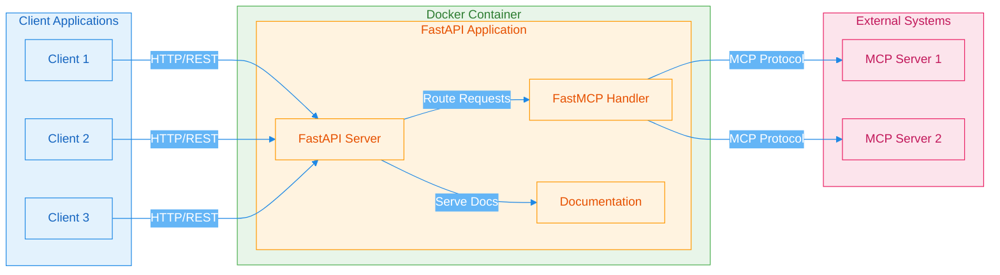
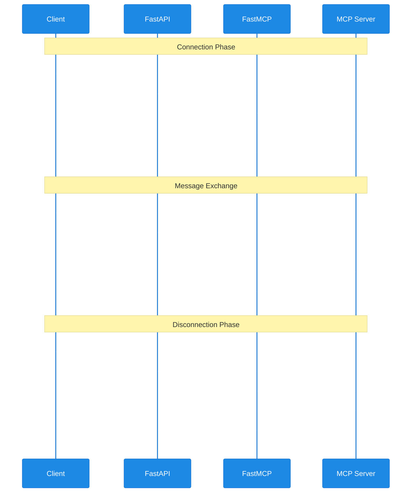

# MCP Service with FastAPI

[](https://www.python.org/downloads/)
[](https://fastapi.tiangolo.com/)
[](LICENSE)
[](https://www.docker.com/)

A modern, containerized Message Control Protocol (MCP) service that provides a RESTful API interface for managing MCP connections and message exchanges. This service acts as a bridge between HTTP clients and MCP servers, making it easy to integrate MCP functionality into web applications.

## Table of Contents
- [What is MCP?](#what-is-mcp)
- [Features](#features)
- [Quick Start](#quick-start)
- [Configuration](#configuration)
- [API Usage](#api-usage)
- [Architecture](#architecture)
- [Development](#development)
- [Troubleshooting](#troubleshooting)
- [Contributing](#contributing)
- [Disclaimer](#disclaimer)
- [License](#license)

## What is MCP?

Message Control Protocol (MCP) is a protocol used for reliable message exchange between systems. This service provides a modern HTTP interface to interact with MCP servers, allowing you to:
- Establish and manage MCP connections
- Send and receive messages
- Monitor connection status
- Handle multiple MCP server connections

## Features

- 🚀 **FastAPI-based REST API**: Modern, high-performance API with automatic OpenAPI documentation
- 🔄 **Async Support**: Built with async/await for better performance
- 🔒 **Connection Management**: Secure connection handling with authentication
- 📊 **Status Monitoring**: Real-time connection status tracking
- 📝 **Interactive Documentation**: Built-in Swagger UI and ReDoc interfaces
- 🐳 **Docker Support**: Easy deployment with Docker
- 🧪 **Comprehensive Testing**: Full test coverage with pytest

## Quick Start

### Prerequisites

- Docker (version 20.10.0 or higher)
- Make (version 4.0 or higher)
- Git
- Python 3.11+ (for local development)

### Running with Docker

1. Clone the repository:
```bash
git clone <repository-url>
cd <repository-name>
```

2. Build and run the container:
```bash
make build
make run
```

The service will be available at `http://localhost:5000`

### Local Development Setup

1. Create a virtual environment:
```bash
python -m venv venv
source venv/bin/activate  # On Windows: venv\Scripts\activate
```

2. Install dependencies:
```bash
pip install -r requirements.txt
```

3. Run the development server:
```bash
uvicorn app:app --reload --host 0.0.0.0 --port 5000
```

## Configuration

The service can be configured using environment variables:

```bash
# MCP Server Configuration
MCP_HOST=your-mcp-server
MCP_PORT=1234
MCP_USERNAME=your-username
MCP_PASSWORD=your-password

# API Configuration
API_HOST=0.0.0.0
API_PORT=5000

# Optional Configuration
LOG_LEVEL=INFO  # DEBUG, INFO, WARNING, ERROR, CRITICAL
ENVIRONMENT=development  # development, staging, production
```

## API Usage

### 1. Connect to MCP Server

```bash
curl -X POST http://localhost:5000/mcp/connect \
  -H "Content-Type: application/json" \
  -d '{
    "host": "mcp-server",
    "port": 1234,
    "username": "user",
    "password": "pass"
  }'
```

### 2. Send a Message

```bash
curl -X POST http://localhost:5000/mcp/send \
  -H "Content-Type: application/json" \
  -d '{
    "type": "message_type",
    "content": "Hello, MCP!",
    "metadata": {
      "priority": "high",
      "tags": ["test", "example"]
    }
  }'
```

### 3. Check Connection Status

```bash
curl http://localhost:5000/mcp/status
```

### 4. Disconnect from MCP Server

```bash
curl -X POST http://localhost:5000/mcp/disconnect
```

## Architecture

### System Overview


### Request Flow


## Development

### Running Tests

```bash
# Run all tests
make test

# Run tests with coverage report
make test-cov

# Run specific test types
make test-unit
make test-integration
```

### Available Make Commands

- `make build` - Build the Docker image
- `make run` - Run the Docker container
- `make test` - Run all tests
- `make test-cov` - Run tests with coverage report
- `make test-unit` - Run unit tests
- `make test-integration` - Run integration tests
- `make clean` - Clean up Docker containers and images

## Troubleshooting

### Common Issues

1. **Docker Build Fails**
   - Ensure Docker is running
   - Check if you have sufficient disk space
   - Verify network connectivity

2. **Connection Issues**
   - Verify MCP server is running and accessible
   - Check firewall settings
   - Validate credentials

3. **Test Failures**
   - Ensure all dependencies are installed
   - Check Python version compatibility
   - Verify environment variables are set correctly

### Debugging

To enable debug logging, set the environment variable:
```bash
LOG_LEVEL=DEBUG
```

## API Documentation

Once the service is running, you can access the interactive API documentation at:
- Swagger UI: `http://localhost:5000/docs`
- ReDoc: `http://localhost:5000/redoc`

## Contributing

1. Fork the repository
2. Create a feature branch (`git checkout -b feature/amazing-feature`)
3. Commit your changes (`git commit -m 'Add some amazing feature'`)
4. Push to the branch (`git push origin feature/amazing-feature`)
5. Open a Pull Request

### Development Guidelines

- Follow PEP 8 style guide
- Write tests for new features
- Update documentation as needed
- Keep commits atomic and well-described

## Disclaimer

This project was created entirely through a conversation with an AI assistant (Claude 3.7 Sonnet) using Cursor IDE. The AI helped with:
- Project structure and architecture design
- Code implementation and best practices
- Documentation and README creation
- Testing framework setup
- Docker configuration
- Git repository initialization

All code, documentation, and configuration files were generated through this collaborative process, demonstrating the capabilities of AI-assisted development.

## License

This project is licensed under the MIT License - see the [LICENSE](LICENSE) file for details. 